👋 Hi, I’m NSPG911!

#### 👷 Check out my recent contributions!

- [NSPC911/le-bucket](https://github.com/NSPC911/le-bucket) - A bunch of scoop apps that I thought to add but dunno which bucket to add (1 day ago)
- [NSPC911/rovr](https://github.com/NSPC911/rovr) - A post-modern terminal file manager. (1 day ago)
- [NSPC911/dotfiles](https://github.com/NSPC911/dotfiles) - My extensive Windows 11 configuration. (2 days ago)
- [NSPC911/bongo-cat](https://github.com/NSPC911/bongo-cat) - A bongocat that lives on your taskbar. Made with Python. (1 week ago)
- [NSPC911/themes](https://github.com/NSPC911/themes) - Repository of the themes I use and have modified (1 week ago)

#### 🔨 My recent Pull Requests!

- [Feat/powershell completions](https://github.com/nat-n/poethepoet/pull/358) on [nat-n/poethepoet](https://github.com/nat-n/poethepoet) (3 days ago)
- [feat: include commit hash when building](https://github.com/NSPC911/rovr/pull/218) on [NSPC911/rovr](https://github.com/NSPC911/rovr) (4 days ago)
- [feat(screens): add shell exec screen](https://github.com/NSPC911/rovr/pull/217) on [NSPC911/rovr](https://github.com/NSPC911/rovr) (6 days ago)

#### 🖥 I'm available here!

  
  
  
  
  

### 📊 Stats about my account!

  
   
  

