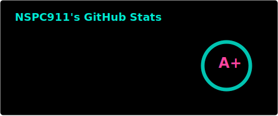

👋 Hi, I’m NSPG911!

#### 👷 Check out my recent contributions!

- [NSPC911/le-bucket](https://github.com/NSPC911/le-bucket) - A bunch of scoop apps that I thought to add but dunno which bucket to add (today)
- [NSPC911/dotfiles](https://github.com/NSPC911/dotfiles) - My extensive Windows 11 configuration. (1 day ago)
- [NSPC911/rovr](https://github.com/NSPC911/rovr) - A post-modern terminal file manager. (1 day ago)
- [NSPC911/textual-chafa](https://github.com/NSPC911/textual-chafa) - like textual-image but with the chafa.py thing as backend (5 days ago)
- [NSPC911/textual-trials](https://github.com/NSPC911/textual-trials) - A lot of trial and error scripts (6 days ago)

#### 🔨 My recent Pull Requests!

- [refactor: switch to an `actions_` oriented method api](https://github.com/NSPC911/rovr/pull/238) on [NSPC911/rovr](https://github.com/NSPC911/rovr) (1 week ago)
- [add test suite](https://github.com/NSPC911/rovr/pull/233) on [NSPC911/rovr](https://github.com/NSPC911/rovr) (2 weeks ago)
- [feat: iterm2 inline image protocol support](https://github.com/lnqs/textual-image/pull/87) on [lnqs/textual-image](https://github.com/lnqs/textual-image) (3 weeks ago)

#### 🖥 I'm available here!

  
  
  
  
  

### 📊 Stats about my account!

  
   
  

