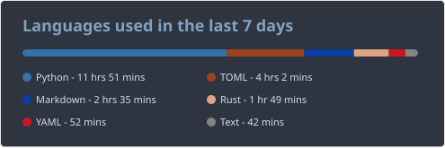

Hi, I’m NSPG911!

I'm an 18-year-old student studying in Singapore.

I am proficient in Python, HTML, CSS and JS

#### My recently committed repositories!

- [NSPC911/rovr](https://github.com/NSPC911/rovr) - a stylish, batteries-included terminal file manager. (today)
- [NSPC911/dotfiles](https://github.com/NSPC911/dotfiles) - My extensive Windows 11 and Linux dotfiles (3 days ago)
- [NSPC911/le-bucket](https://github.com/NSPC911/le-bucket) - A bunch of scoop apps that I thought to add but dunno which bucket to add (5 days ago)
- [wezterm/wezterm](https://github.com/wezterm/wezterm) - A GPU-accelerated cross-platform terminal emulator and multiplexer written by @wez and implemented in Rust (1 week ago)
- [NSPC911/textual-trials](https://github.com/NSPC911/textual-trials) - A lot of trial and error scripts (1 week ago)

#### My recent Pull Requests!

- [feat: follow symlinks](https://github.com/NSPC911/rovr/pull/351) on [NSPC911/rovr](https://github.com/NSPC911/rovr) (2 days ago)
- [fix(xterm): remove alt check](https://github.com/Textualize/textual/pull/6709) on [Textualize/textual](https://github.com/Textualize/textual) (2 days ago)
- [fix(xterm): remove alt check](https://github.com/NSPC911-forks/textual/pull/1) on [NSPC911-forks/textual](https://github.com/NSPC911-forks/textual) (2 days ago)

#### You can find me in these places!

  
  
  
  
  

### Mildly useful stats about my account

  
   
  
   
  
  

<image src="https://count.getloli.com/@NSPC911?name=NSPC911&theme=3d-num&padding=7&offset=0&align=top&scale=1&pixelated=0&darkmode=auto" alt="" width=0 height=0 />
