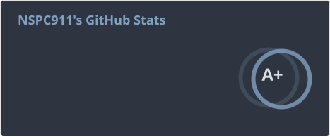

Hi, I’m NSPG911!

I'm a 18 year old student studying in Singapore.

I am proficient in Python, HTML, CSS and JS

#### My recently committed repositories!

- [NSPC911/rovr](https://github.com/NSPC911/rovr) - a stylish, batteries-included terminal file manager. (1 day ago)
- [NSPC911/le-bucket](https://github.com/NSPC911/le-bucket) - A bunch of scoop apps that I thought to add but dunno which bucket to add (3 days ago)
- [NSPC911/dotfiles](https://github.com/NSPC911/dotfiles) - My extensive Windows 11 configuration. (4 days ago)
- [NSPC911/nspc911.github.io](https://github.com/NSPC911/nspc911.github.io) - woah cool site (5 days ago)
- [NSPC911/pytrash](https://github.com/NSPC911/pytrash) - high level api for recycling (1 week ago)

#### My recent Pull Requests!

- [feat: allow multiple paths in cli](https://github.com/NSPC911/rovr/pull/317) on [NSPC911/rovr](https://github.com/NSPC911/rovr) (2 days ago)
- [feat: allow themeing checked options](https://github.com/NSPC911/rovr/pull/316) on [NSPC911/rovr](https://github.com/NSPC911/rovr) (2 days ago)
- [fix: prevent `Process`-es from importing from cwd](https://github.com/NSPC911/rovr/pull/313) on [NSPC911/rovr](https://github.com/NSPC911/rovr) (6 days ago)

#### You can find me in these places!

  
  
  
  
  

### Mildly useful stats about my account

  
   
  
   
  
  

